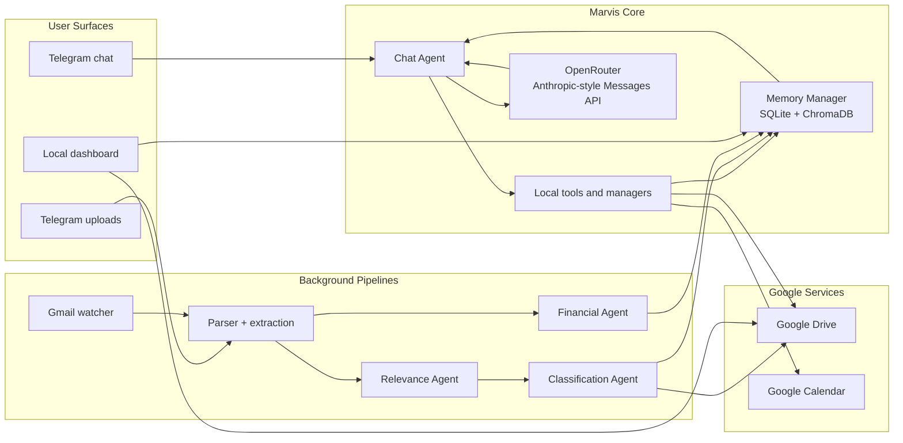

<p align="center">
  
</p>

<h1 align="center">Marvis</h1>

<p align="center">
  <strong>Marvelous Jarvis</strong> is a local AI assistant that talks over Telegram, watches Gmail, files documents into Google Drive, remembers useful context, and stays inspectable through a local dashboard.
</p>

<p align="center">
  
  
  
  
  
  
  
</p>

<p align="center">
  <a href="./docs/index.html"><strong>Docs</strong></a>
  |
  <a href="./docs/medium-marvis-article.md"><strong>Medium Article Draft</strong></a>
  |
  <a href="http://127.0.0.1:8080/docs"><strong>Local Docs Route</strong></a>
</p>

> Marvis is designed as a real operator-facing personal assistant, not a toy chatbot. It keeps the agent loop close to Anthropic's Messages model, adds deterministic guardrails around dates and structured outputs, and exposes memory, Drive state, and activity through a local dashboard.

## Why Marvis

Most personal assistants look good in chat and fall apart when they touch real systems.

Marvis is built around a different idea:

- keep the model loop simple and Claude-shaped
- let the application own storage, time, validation, and side effects
- expose memory and recent actions so the system stays inspectable
- treat Gmail filing, calendar writes, and document handling like product workflows, not prompt stunts

That gives you an assistant that can actually do useful local work:

| Surface | What Marvis does |
|---|---|
| Telegram chat | answers questions, recalls memory, searches Drive context, creates tasks, checks calendar |
| Gmail watcher | scans unread mail after a cutoff date, filters low-value mail, files useful attachments |
| Google Drive filing | classifies uploads and attachments into a fixed folder structure with predictable names |
| Memory | stores durable facts, preferences, decisions, and document references in SQLite plus ChromaDB |
| Obsidian notes | writes collaborative Markdown notes into a shared vault with Marvis-chosen organization |
| Dashboard | shows overview, memory, Drive files, LLMOps telemetry, activity, and interactive docs |
| Docs | ships with local architecture docs plus a Medium-ready article draft |

## Architecture

Marvis has one long-lived chat agent and several specialized LLM-driven stages for background workflows.



Interactive architecture docs live in [docs/index.html](./docs/index.html) and on the dashboard route [http://127.0.0.1:8080/docs](http://127.0.0.1:8080/docs).

### Runtime Roles

- **Chat Agent** (`core/agent.py`) handles the Anthropic-format tool loop and assembles final replies.
- **Relevance Agent** (`gmail/relevance.py`) decides whether a Gmail message is worth filing.
- **Classification Agent** (`agent_sdk/filer.py`) picks the Drive path, filename, and summary for attachments and uploads.
- **Vision Agent** (`utils/text_extraction.py`) describes image-heavy documents when plain extraction is not enough.
- **Financial Agent** (`utils/financial_extraction.py`) extracts vendor, amount, category, and date for finance-oriented documents.

## What Makes It Reliable

The model is allowed to reason. The app is responsible for reality.

Marvis hardens the risky parts of agent behavior with deterministic code:

- relative dates like `today`, `tomorrow`, and `Monday` are resolved locally before calendar or task actions run
- structured outputs are parsed and validated before they can mutate storage
- Gmail backfills are bounded by a configured cutoff date
- document filing prefers preserving useful documents over silently dropping them
- memory is externalized into structured records instead of hidden in conversation state

This turned out to matter more than prompt polish. The biggest failures in agent systems are usually plausible outputs that are just wrong enough to cause trouble.

## Features

| Capability | Details |
|---|---|
| Claude-style agent loop | Hand-rolled `system + messages + tools` loop with `tool_use` / `tool_result` round trips |
| OpenRouter routing | Anthropic-compatible transport with Claude as the safe default and optional task-level overrides |
| Persistent memory | SQLite for source of truth plus ChromaDB for semantic retrieval |
| Gmail monitoring | Polls unread mail every 5 minutes and starts only after the configured cutoff date |
| Smart filing | Classifies documents and uploads them into a structured Google Drive library |
| Financial extraction | Pulls vendor, amount, date, and category from finance-oriented documents |
| Telegram bot | Single-user bot with slash commands, uploads, and long-polling deployment |
| Obsidian integration | Writes collaborative Markdown notes into a configurable vault path |
| Dashboard | Overview, memory browser, Drive mirror, LLMOps telemetry, activity log, and interactive docs |
| Article-ready docs | Includes a Medium draft that explains the architecture and tradeoffs |

## Quick Start

### 1. Clone and install

```bash
git clone https://github.com/boubakerwa/jarvis.git
cd jarvis
python3.12 -m venv .venv
source .venv/bin/activate
python -m pip install --upgrade pip
python -m pip install -r requirements.txt
```

Marvis now targets Python 3.12. If you are upgrading an older checkout, recreate the virtual environment first.

### 2. Configure `.env`

```bash
cp .env.example .env
```

Fill in the main settings:

```env
OPENROUTER_API_KEY=sk-or-...
OPENROUTER_BASE_URL=https://openrouter.ai/api
OPENROUTER_MODEL=anthropic/claude-sonnet-4.6

TELEGRAM_BOT_TOKEN=...
TELEGRAM_ALLOWED_USER_ID=...

GOOGLE_CREDENTIALS_PATH=.credentials.json
GOOGLE_TOKEN_PATH=token.json

JARVIS_TIMEZONE=Europe/Berlin
OBSIDIAN_VAULT_PATH=/absolute/path/to/your/Obsidian/vault
OBSIDIAN_ROOT_FOLDER=.

# Optional lower-risk Gemma routing:
# OPENROUTER_MODEL_RELEVANCE=google/gemma-4-31b-it
# OPENROUTER_MODEL_FINANCIAL=google/gemma-4-31b-it
```

### 3. Set up Google OAuth

1. Open [Google Cloud Console](https://console.cloud.google.com/).
2. Create a project and enable **Gmail API**, **Google Drive API**, and **Google Calendar API**.
3. Create OAuth 2.0 desktop credentials and save them as `.credentials.json`.
4. On first run, complete the consent flow in your browser. Marvis will create `token.json` automatically.

### 4. Run the app

```bash
python main.py
```

### 5. Run the dashboard

```bash
python -m dashboard
```

Open [http://127.0.0.1:8080](http://127.0.0.1:8080).

## Telegram Commands

| Command | Description |
|---|---|
| Any message | Goes through the chat agent |
| `/status` | Shows memory count, Drive status, and configured model |
| `/llmops` | Shows recent token usage, estimated LLM cost, latency, top LLM tasks, and short-horizon ops health |
| `/memories` | Lists stored memories grouped by category |
| `/forget <topic>` | Deletes a memory by topic |
| `/reset` | Clears in-session chat history while preserving long-term memory |
| File or photo upload | Runs the classification and filing pipeline |

## Memory Model

Each memory is stored as a structured record:

| Field | Description |
|---|---|
| `topic` | Deduplication key |
| `summary` | Short description of the fact or decision |
| `category` | `preference`, `fact`, `decision`, `document_ref`, `project`, `household`, `finance`, or `health` |
| `source` | `telegram`, `email`, `document`, or `manual` |
| `confidence` | `high`, `medium`, or `low` |
| `document_ref` | Google Drive file ID for filed documents |
| `supersedes` | UUID of the record it replaced |

Before each model call, the top relevant memories are retrieved from ChromaDB and injected into the system prompt.

## Obsidian Notes

If you set `OBSIDIAN_VAULT_PATH`, Marvis writes into that vault as a shared notes workspace. Set `OBSIDIAN_ROOT_FOLDER=.` if you want it to write directly at the vault root, or set a folder name if you want everything grouped under a subfolder. This works especially well with iCloud on Apple devices because Marvis only writes plain Markdown files.

Marvis is not locked into a preset folder taxonomy. The agent can choose the note title, folder, and structure that best fit the request, then reuse or extend existing notes through search and append operations.

Once enabled, you can ask things like:

- `Please add a leather weekender bag as a gift idea for my wife`
- `Please write a new article draft for local-first assistants`
- `What are my hottest project ideas right now?`

## Drive Filing Layout

Files are organized under the existing Drive root folder `Jarvis/` for backward compatibility.

<details>
<summary><strong>Current folder structure</strong></summary>

```text
Jarvis/
|- Finances/          (Banking, Investments, Tax)
|- Insurance/         (Health, Liability, Vehicle)
|- Legal & Contracts/ (Employment, Rental, Service Agreements)
|- Travel/            (Bookings, Visas & Docs)
|- Health/            (Records, Prescriptions)
|- Subscriptions/
|- Real Estate/
|- Vehicles/
|- Projects & Side Hustles/ (Sufra, Other)
|- Personal Development/    (Courses & Certificates, Books & Resources)
|- Household/         (Appliances & Warranties, Repairs & Services, Utilities)
`- Misc/
```

</details>

Files are named `YYYY-MM_description.ext` for chronological sorting.

## Dashboard and Docs

The local dashboard gives Marvis an operator surface instead of a black box:

- **Overview** for system status and recent activity
- **Memory** to inspect what Marvis currently retains about you
- **Drive** to mirror the Google Drive files Marvis can see
- **LLMOps** for token usage, estimated model cost, inline charts, heartbeat freshness, issue breakdowns, and recent audit events
- **Docs** for architecture walkthroughs and setup help

Observability data now uses retention-aware JSONL streams:

- `data/llm_activity.jsonl` for model call telemetry
- `data/ops_activity.jsonl` for positive activity and heartbeats, retained for 5 minutes
- `data/ops_issues.jsonl` for warnings and errors, retained for 3 days
- `data/ops_audit.jsonl` for low-volume mutation events such as task creation, note writes, uploads, and calendar writes

It also ships with:

- [docs/index.html](./docs/index.html): interactive architecture and operations docs
- [docs/medium-marvis-article.md](./docs/medium-marvis-article.md): a Medium-ready article draft about Marvis

## Provider Notes

- As of April 5, 2026, Claude via OpenRouter is validated for Marvis's Anthropic-style tool loop.
- Gemma 4 also worked in live smoke tests, but showed slower latency and more JSON/schema drift.
- Recommended rollout: keep chat, document classification, and vision on Claude first.
- If you want to experiment, route Gemma only into lower-risk paths like relevance or financial extraction.

## Project Layout

<details>
<summary><strong>Repository map</strong></summary>

```text
jarvis/
|- main.py
|- requirements.txt
|- .env.example
|- config/
|  `- settings.py
|- core/
|  |- agent.py
|  |- llm_client.py
|  |- prompts.py
|  |- structured_output.py
|  `- time_utils.py
|- calendar_api/
|  `- client.py
|- memory/
|  |- manager.py
|  `- schema.py
|- gmail/
|  |- parser.py
|  |- relevance.py
|  `- watcher.py
|- storage/
|  |- drive.py
|  `- schema.py
|- agent_sdk/
|  `- filer.py
|- utils/
|  |- financial_extraction.py
|  `- text_extraction.py
|- telegram_bot/
|  `- bot.py
|- dashboard/
|  |- app.py
|  `- assets/
|- docs/
|  |- index.html
|  `- medium-marvis-article.md
`- tests/
```

</details>

## Validation

The branch includes automated coverage for:

- OpenRouter client wiring
- Anthropic-format tool loop behavior
- structured output validation
- date resolution and calendar safety
- Gmail watcher cutoff behavior
- dashboard rendering and client-side interactions
- Telegram command publishing

Run the suite with:

```bash
python -m unittest discover -s tests
```

## Current Status

| Area | Status |
|---|---|
| Chat agent and tools | Done |
| Gmail watcher and filing pipeline | Done |
| Memory system | Done |
| Dashboard and docs | Done |
| Python 3.12 project setup | Done |
| Launchd packaging | Not yet shipped |
| PR polish and broader production hardening | In progress |

---

<p align="center">
  Built by Wess for personal use. Marvis keeps the assistant local, useful, and inspectable.
</p>
